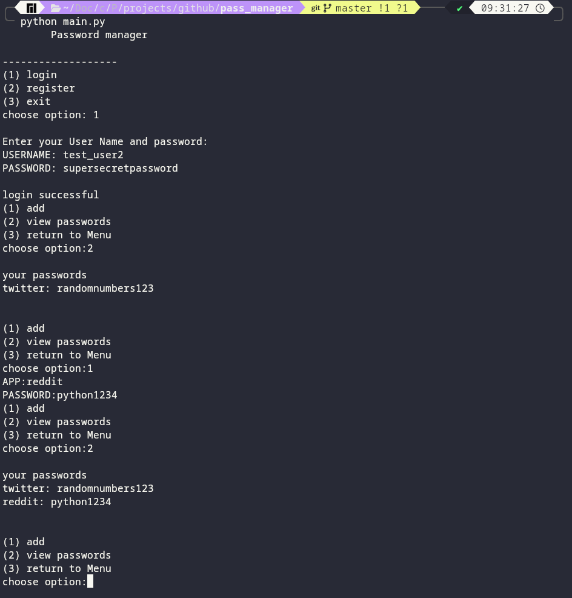
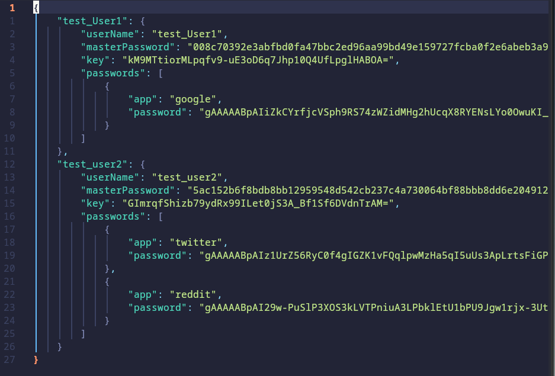

# Python-password-manager
A very basic password manager made in python with the use of in-built libraries to encrypt and store user passwords 

It uses very basic encryption and JSON and can store many different users each with their own master password and cipher 

## output of code 

- the code uses a really minimal text user interface i have plans to later add a full gui with the use of librarys such as tk inter
- the code allows the user to add another user , login or exit
- once logged in the user is able to add new passwords or view old ones

## json 
 
- all of the user data is stored in a json file
- it allows for multiple users and each user can have multiple passwords
- each user has their own key to decrypt their own passwords and this can only accessed in the program by the users "master password"
